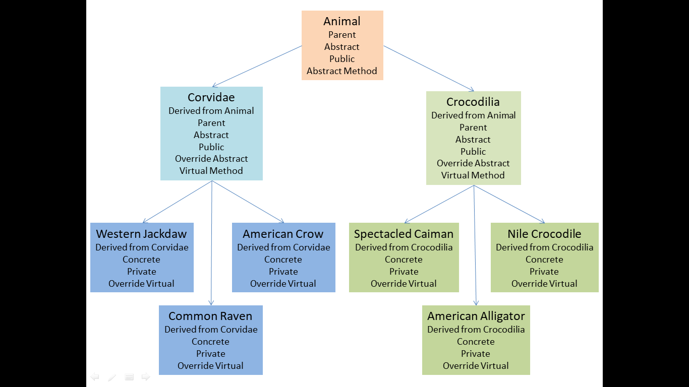

# Zoo
## Description
This is a sample zoo hierarchy that shows the relationships between classes and derived classes using the fun backdrop of a fictional zoo made up of Crows and Crocodiles.

## OOP Principles
### Encapsulation
The process of changing access modifiers on different classes, methods, and properties in order to protect them.
My Animal, Corvidae, and Crocodilia classes are public while my Crow, Raven, Jackdaw, Alligator, Crocodile, and Caiman classes are private.

### Polymorphism
The process of changing methods and properties on a derived class from the methods and properties in the base class. 
My Animal has abstract methods and properties that are overridden in my Corvidae and Crocodilia classes.  My Corvidae class has a virtual method that is overridden in my Raven, Crow, and Jackdaw classes. My Crocodilia class has a virtual method that is overridden by my Crocodile, Caiman and Alligator classes.

###  Abstraction
Classes, methods, and properties that are considered incomplete that are to be filled in by derived classes.
My Animal, Corvidae, and Crocodilia classes are abstract and are overridden by my Crow, Raven, Jackdaw, Alligator, Crocodile, and Caiman classes.

### Inheritance
Creating classes that are derived from a base class.  Derived classes share methods and properties with the base class.
My Animal class shares properties with my Corvidae and Crocodilia classes. My Corvidae shares a property with my Crow, Jackdaw, and Raven classes. My Crocodilia class shares a property with my Caiman, Crocodile, and Alligator classes.
